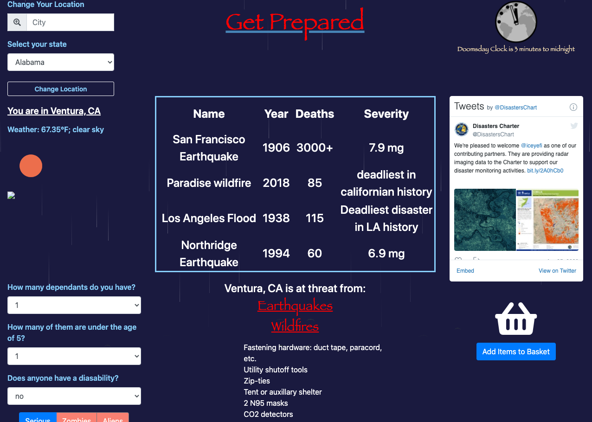

# Get Prepared

Deployed: https://wrg93.github.io/project1/
Repo: https://github.com/wrg93/project1

## Description
As a user seeking disaster preparedness I want my location to be identified or be entered 
So that I may able to see a history of natural disasters in my area 
And I am given a list of most relevant survival supplies I want to be able to enter variables such as infants and number of dependents
So that my list of necessities is adjusted correctly I want to be able to save a list of objects in local storage 
So that I may use said list to purchase objects online
    
#Table of Contents
    
-[Installation] (#installation)
    
-[Usage](#usage)
    
-[License](#license)
    
-[Questions](#questions)
    
## Installation
    
To install necessary dependencies, run the following command:
...
no installation necessary
...
    
## Usage
    
-When the website is launched, allow the browser to access your location. Your city and state, current weather of your location, and a map of your location will be displayed. 
-In the middle of the page, you will see notable disasters that occurred in your region 
-Choose whether you have any dependents, any children, or anyone with disabilities and then click on generate list to display a survival list based on what you have chosen and what disasters are prone in your area. 
-Click on any of the items in the list and then click on add to my basket to display the items in a clickable link that will take you to google shop. 
-You can change your location by inputting a city and state and then clicking on change your location. 
-On website launch, may need to scroll down on MacOS.

## License
    
This project is licensed under MIT
    
## Contributing
    
JavaScript, jQuery, CSS, HTML
    
## Tests
    
To run tests, run the following command:
  
...
no tests
...
    
## Questions
    
If you have any questions please email me at wrgrundler@gmail.com. 

To view more projects please visit https://github.com/wrg93.
    
